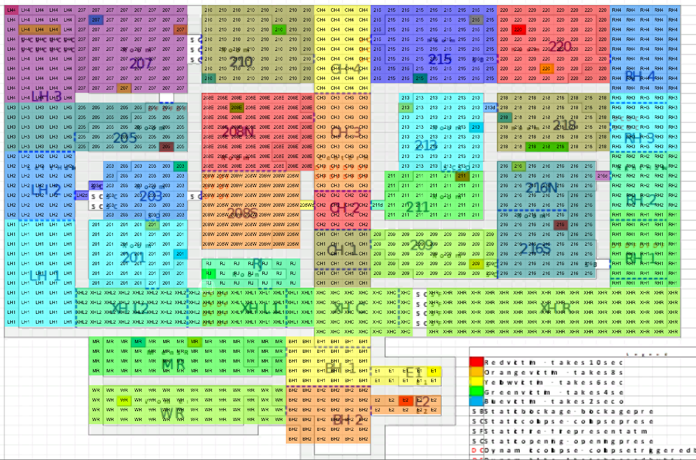
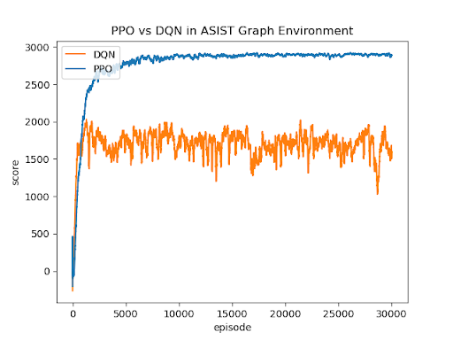

The [DARPA Artificial Social Intelligence for Successful Teams (ASIST) program](https://www.darpa.mil/program/artificial-social-intelligence-for-successful-teams) seeks to develop foundational AI theory and systems that demonstrate the basic machine social skills needed to infer the goals and situational knowledge of human partners, predict what they will need, and offer context-aware actions in order to perform as adaptable and resilient AI teammates. For this study, a Search-and-Rescue (SAR) experiment was conducted in the game [Minecraft](https://www.minecraft.net/en-us).

The DARPA ASIST Minecraft SAR task (“our” task) is a game-based simulated training environment designed with the explicit purpose of developing artificial social intelligent agents. The task places participants in a Minecraft environment where they attempt to save victims of an urban disaster and earn points for doing so. Victims are either non-critical or critical, the latter of which are worth more points but take more time to save. All victims locates in rooms, where some rooms may be empty and some may have more than one. The triaging agent has a device that, when at the entrance of room, gives unique signals when either there is at least one non-critical victims inside the room or there is at least one critical victims inside the room. One experiment session has a time limit of 10 minutes and all critical victims will decease after 5 minutes to be no longer scorable. The objective of the triager is to maximize its score within the time limit. Further details about the environment are available in the [pre-registration](https://doi.org/10.17605/OSF.IO/GXPQ5).

At an early stage of the experiment, the SAR task can be modeled as a single-agent route optimization problem, where a shortest path must be found that triages all victims while keeping the total distance as short as possible, and it can always become more computationally challenging with a larger graph and additional constaints. Since the map is highly structured, we can transform the map to a simplified graph environment, with nodes representing rooms and victims, and edges representing connections with edge weight equivelent to travel distance. 

Once the environment is established. We formulated this as a reinforcement learning problem. We standardized the environment to follow the OpenAI gym tradition, therefore anyone with prior experience with openAI gym can easily play around with our environment. We tested the Deep-Q Network (DQN) and the Proximal Policy Optimization (PPO) algorithm. The final result is that PPO outperforms DQN in this particular problem, in saving 19 victims out of 26, where DQN did around 11. 

Several barriers were met during the course of development. The major one is the inconsistency of the length of the action space. In the traditional reinforcement learning problem, there are observation space and action space both of a fixed size. You feed the observed state into a black-box neural network and expecting it to tell you what action to do next. However, the action space in the ASIST environment is not static. The number of valid actions is dependent on the number of neighboring nodes at a particular location. 

We have attempted various methods to tackle this problem. The first one is to allow the agent to pick invalid actions and hoping that, by feeding back a negative reward, it will learn to avoid such action. But the method failed as the action space is simply too large so the training always converged in finding a policy where the agent moves back and forth between the first two valid actions. We also tried to apply a mask at the output layer of the Neural network to force it to choose only the valid actions, this also does not work properly. I also divide the action space into a number of equal-sized bins the same as the number of neighbors at a particular node, and then the chosen action would be the index of the bin that the max value of the output layer matches with. This action space formalization with the PPO model is producing the result shown on the image, where 19 victims are saved. Lastly, I tried to increase the time limit during training to let the agent able to triage all victims at least once, and then focus on shortening the path time. This modification showes significant improvements and the final result is that all victims are saved in just around 5 minutes.


