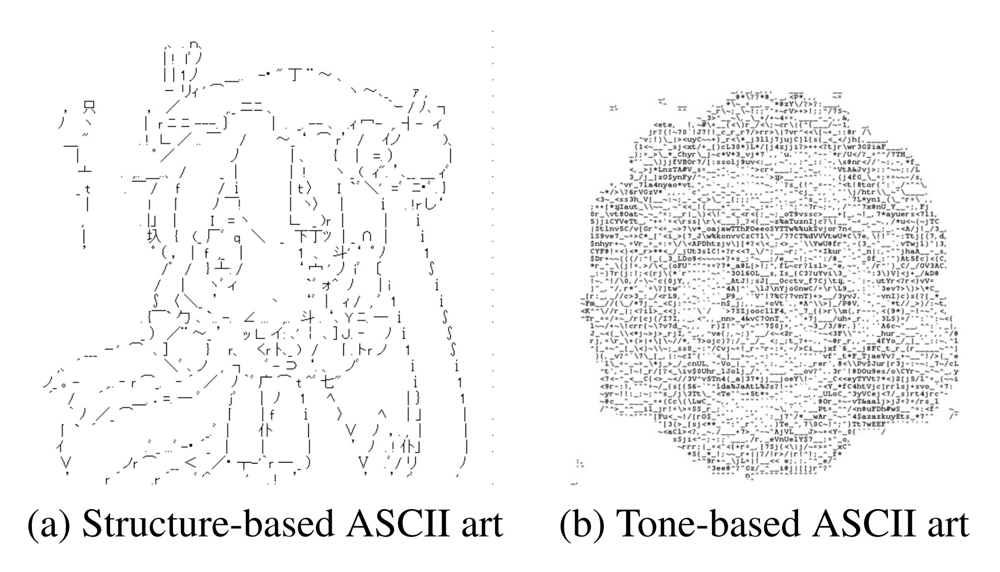

"[Bad Apple!!](https://www.youtube.com/watch?v=9lNZ_Rnr7Jc)" is a Japanese dance-pop song initially featured in one of the arcade games from the Touhou series. Since its rise to popularity on Nico Nico Douga (NND) in 2009, the song has inspired an extensive list of remixes, dances, and musical tributes, primarily on the Japanese web. In October 2010, the original upload became the first NND video to reach 10 million views.



As the original video only consists of black and white color, it can essentially be treated as a bitmap animation, where one can easily stylize the two colors into various forms. For example, people have attempted to recreate the video using pixelated animation, ASCII Art, and even stop motion animation using ordinary objects frame by frame.

There are two types of ASCII art: tone-based ASCII art and structure-based ASCII art. The former places characters based on pixel lightness, which is relatively easy to make and widely made on the Internet. The latter requires recognizing the graphical pattern and placing the closest symbol, which is relatively difficult to make. To tackle this problem, [Akiyama](https://nips2017creativity.github.io/doc/ASCII_Art_Synthesis.pdf) propose a neural image classification method using convolutional neural network. Given a sketch image, they first segment the image into non-overlap patches. Then for each patch, they run the classification model to replace it with the actual ascii character. Their code is publically available on [this GitHub repo](https://github.com/OsciiArt/DeepAA), and you can try it yourself in [this web application](https://tar-bin.github.io/DeepAAonWeb/).

To use their method, I first uses regular canny edge detection method on the Bad Apple video. And then apply Akiyama’s method: for each frame, divide it into thousands of tiles, and do image recognition with deep neural network to find the closest matching character for each individual tile. Finally, make them back to images and joined to a full video. 

