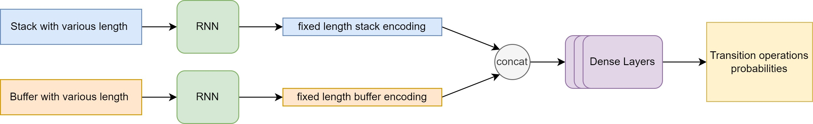

The term Dependency Parsing (DP) refers to the process of examining the dependencies between the phrases of a sentence in order to determine its grammatical structure. A sentence is divided into many sections based mostly on this. The process is based on the assumption that there is a direct relationship between each linguistic unit in a sentence. These hyperlinks are called dependencies.

In this class project, I implemented a simpler version of the dependency parser introduced by [Chen & Manning (2014)](https://aclanthology.org/D14-1082/) using deep neural networks. We used the [CoNLL-X](https://conll.uvt.nl/) dependency format and data, where each word in a sentence is annotated with its POS tag, parent word, dependency relation, and related indices.

For example, the following sentence annotation would construct the dependency tree shown in the featured image at the top:

```
1 The _ DT DT _ 2 dt _ _
2 cat _ NN NN _ 3 nsubj _ _
3 eats _ VB VB _ 0 root _ _
4 tasty _ JJ JJ _ 5 amod _ _
5 fish _ NN NN _ 3 dobj _ _
6 . _ . . _ 3 punct _ _
```

The dependency parser I used is a transition-based dependency parser. Three data structures are maintained throughout the parsing process: a stack that contains words in the sentence currently being processed; a buffer that contains words in the sentence that still need to be processed; and a partial dependency tree that contains dependency arcs to build three. There are three transition operations: SHIFT, LEFT-ARC, and RIGHT-ARC. Given the current stack and buffer state, the neural network should make predictions to the best next transition operation with dependency relationship.


The input representation consists of the top-three words on the buffer and the next-three words on the stack, so it is a vector of size 6. If the length is less than three, a padding token will be added. Besides the padding token, I also uses special token such as `<CD>`, which replaces numerals, `<NNP>`, which replaces proper nouns, `<UNK>`, which replaces words that appears only once in the vocabulary, and `<ROOT>`, which represents the root token at the beginning of the stack. The output representation is a one-hot encoding of 91 possible transition operation with relation. 

The neural network consists of one embedding layer that projects size 6 to size 32, followed by a dense hidden layer of size 100, a dense hidden layer of size 10, and an output layer with softmax activation. Hidden layers are activated by the ReLU function. Network parameters are optimized by using Adam with categorical cross entropy loss and learning rate of 0.01. The network is implemented in Tensorflow.

The softmax output represents the probability of the next transition operation given the current state. However, it is possible that the highest scoring transition is not possible. For instance, arc-left or arc-right are not permitted if the stack is empty. Shifting the only word out of the buffer is also illegal, unless the stack is empty. Finally, the root node must never be the target of a left-arc. Instead of selecting the highest-scoring action, select the highest scoring permitted transition. 

Finally, I evaluated my parser with the Labeled Attachment Score (LAS), which is the percentage of correct (parent, relation, child) predictions. Even though the output looks reasonable for many sentences, the score for the parser is relatively low (~70 LAS). One possible limitation of my network is that it only takes a fixed length sentence input (6), which the actual stack and buffer could have varying length. To account for this, I encoded the stack and buffer separately with RNN and concatenated the two encoding vectors before feeding into the Dense layers. The network architecture is shown in the figure below:


