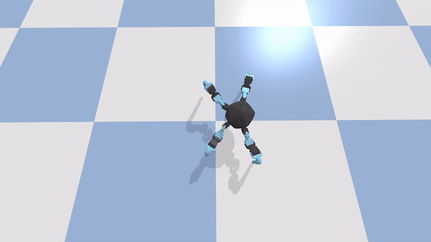
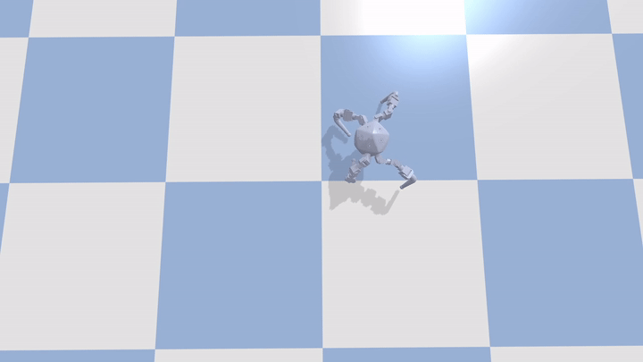

Legged robots are a type of mobile robot which use articulated limbs, such as leg mechanisms, to provide locomotion. They are more versatile than wheeled robots and can traverse many different terrains, though these advantages require increased complexity and power consumption. Legged robots often imitate legged animals, such as humans or insects, as an example of biomimicry.

To control a legged robot, one may use optimization methods such as hill climbing or evolution algorithm to find a gate pattern such as sine gate with alternating leg movement. This gives the robot the ability to move around. However, such movement is robot-specific: we need a separate optimization process for each robot configuration and it heavily relies on labor-intensive hand-crafted simulators which inevitably become outdated as the robot develops. 

While the sense of self is something that robots have been unable to learn themselves, the creation of this sense of self is second nature in humans and many animals. Over the past 30 years, many studies have found evidence that animals recognize themselves in mirrors such as apes, elephants, and pigeons. Until recently it was thought that self-recognition was absent from animals without a neocortex, and was restricted to mammals with large brains and well-developed social cognition. We refer to this sense of ourselves as a "self-model”. 

[Kwiatkowski (2019)](https://www.creativemachineslab.com/deep-self-modeling.html) demonstrated that by recording a sequence of states and actions taken by the robot moving randomly and passing this information to a deep learning model so that it learns to predict the next state from the preceding states and actions, we can use this self-model to allow the robot to "imagine" what will happen to its own body if it takes certain actions, given a specific starting state. This self-model even allows a robot to adapt to conditions when it has a deformed body.



To apply the concept of self-model on legged robots, we made an icosahedron four-legged robot. It has 20 faces where 4 legs can be attached to any 4 faces. Each leg has 3 joints so the robot has 12 degrees of freedom. Ideally, if a self-model has enough dynamic sense of the robot structure, it can be used to control any leg configuration. As a simple step, we wonder what types of improvement or ability the self-model could grant to a single robot configuration.

After optimizing a set of sine gate parameters to the point where the robot is able to move forward but not stable and fast enough (baseline motion), we start to collect the sequence of states and actions and build a deep neural network (self-model) that predicts the robot's future states given the current state and action. By applying the self-model, we discovered that the robot was able to move forward 30% faster compared to the baseline. Also, by adding gaussian noise to the baseline motion, we were able to search motion trajectory from the predicted future that allows the robot to perform turning and backward motions about which the robot has zero prior knowledge.

Our current ongoing research aims to use a single self-model to control over 1000 different robot configurations. More project detail will be exposed upon work published. To learn more about the big picture of the project, take a look at Prof. Hod Lipson's talk at MARS 2022 on building self-aware machines.


