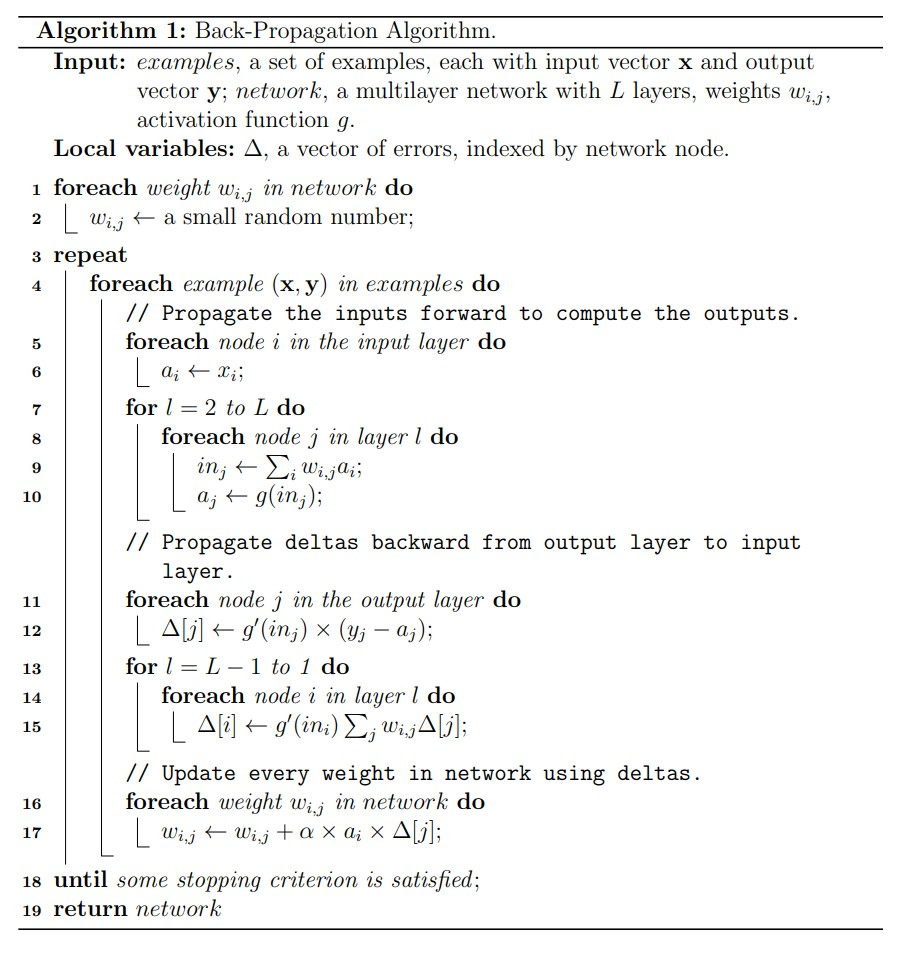
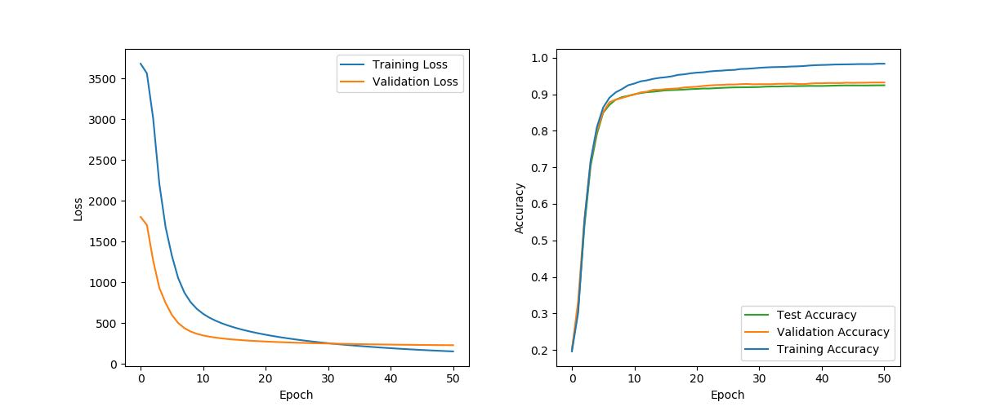

The [MNIST database of handwritten digits](http://yann.lecun.com/exdb/mnist/) is a dataset containing 70,000 labeled handwriting digit images. The task of digits recognition is to classify an image of a handwritten digit into the number 0-9. The database has existed for over 20 years and the task is generally known as a solved task. It has also been generally treated as the ‘Hello World’ problem for learning neural networks. As an introduction, I implemented a simple feed forward neural network without any deep learning libraries using C++ while taking the course “Introduction to Artificial Intelligence.”

Each digit is a greyscale 28x28 image, so the input is a size 784 vector with value ranging from 0 (= black) to 1 (= white). I normalized the value to 0-1 before input. My network consists of 2 linear hidden layers, each with a size of 360, activated by the Sigmoid function. The output layer outputs a size 10 vector representing the 10 digits. To get the output digit, I use the argmax function to get the corresponding index. 

The weight of the network was updated using the vanilla gradient descent algorithm and the Sum of Squared Errors (SSE) loss. To do so, I implemented the Back-Propagation Algorithm. Initially, my network faced the gradient vanishing problem, but the problem was solved after I added a bias term. I also experimented with the tanh activation function and a different network architecture that has only one output node, while representing the output digits using intervals 0-0.1, 0.1-0.2,...,0.9-1.0 for the ten digits. Nonetheless, this version doesn’t get any improvement. 

