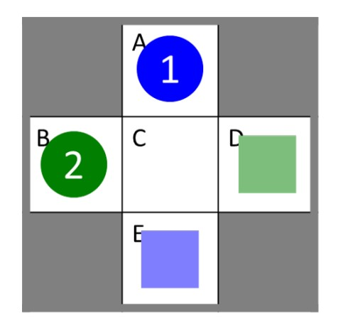
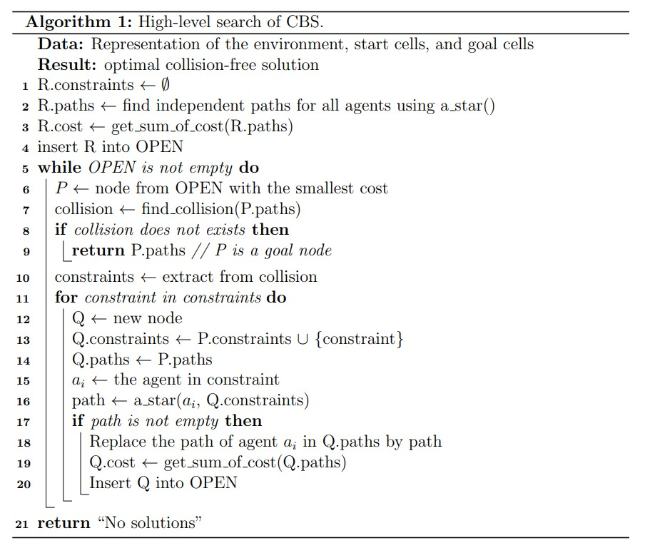
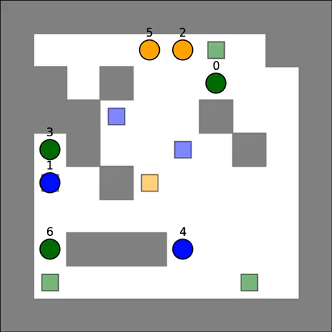

Multi-agent path finding (MAPF) is important for many applications, including automated warehousing and, in the future, also just-in-time manufacturing. Amazon order-fulfillment centers have inventory stations on the perimeter of the warehouse (shown only on the left side in the figure) and storage locations in its center. Each storage location can store one inventory pod. Each inventory pod holds one or more kinds of goods. A large number of warehouse robots operate autonomously in the warehouse. Each warehouse robot is able to pick up, carry, and put down one inventory pod at a time. The warehouse robots move inventory pods from their storage locations to the inventory stations where the needed goods are removed from the inventory pods (to be boxed and eventually shipped to customers) and then back to the same or different empty storage locations. Amazon puts stickers onto the floors of their order-fulfillment centers to delineate a grid and allow for robust robot navigation. However, path planning for the robots is tricky since most warehouse space is used for storage locations, resulting in narrow corridors where robots that carry inventory pods cannot pass each other.



The MAPF problem is a simplified version of this and many other multi-robot or multi-agent path-planning problems and can be described as follows: On math paper, some cells are blocked. The blocked cells and the current cells of n agents are known. A different unblocked cell is assigned to each agent as its goal cell. The problem is to move the agents from their current cells to their respective goal cells in discrete time steps and let them wait there. The optimization objective is to minimize the sum of the travel times of the agents until they reach their goal cells (and can stay there forever). 

### MAPF Example

In the MAPF example above with two agents: agent 1 has to navigate from its current cell A to its goal cell E and agent 2 has to navigate from its current cell B to its goal cell D. One optimal collision-free solution (of cost 5) consists of path `[A, C, E]` (of length 2) for agent 1 and path `[B, B, C, D]` (of length 3) for agent 2. The other optimal collision-free solution (also of cost 5) consists of path `[A, A, C, E]` (of length 3) for agent 1 and path `[B, C, D]` (of length 2) for agent 2.

### Prioritized Planning

[Prioritized planning](https://www.ri.cmu.edu/publications/on-multiple-moving-objects/) orders the agents completely by assigning each agent a different priority. It then plans paths for the agents, one after the other, in order of decreasing priority. It finds a path for each agent that does not collide with the environment or the (already planned) paths of all higher-priority agents (which can be done fast). Prioritized planning is fast but suboptimal (meaning that it does not always find an optimal collision-free solution) and even incomplete (meaning that it does not always find a collision-free solution even if one exists). If it finds a solution, then the solution is collision-free but the cost of the solution depends heavily on the priorities of the agents.

### Conflict-Based Search

[Conflict-Based Search (CBS)](https://www.aaai.org/ocs/index.php/AAAI/AAAI12/paper/viewFile/5062/5239) first plans shortest paths for all agents independently (which can be done fast). These paths do not collide with the environment but are allowed to collide with the paths of the other agents. If this results in a collision-free solution, then it has found an optimal collision-free solution. Otherwise, it chooses a collision between two agents and considers recursively two cases. The hope is that CBS finds a collision-free solution before it has imposed all possible constraints. As a two-level search algorithm, CBS is slower than prioritized planning but complete and optimal. 

### Immplementation

For this project, I first immplemented a time-space A* search that searches in x-y-t space and returns a shortest path that satisfies a given set of constraints for a single agent. Then, I implemented a prioritized MAPF solver based on my time-space A* solver. The prioritized MAPF solver finds paths for all agents, one after the other, that do not collide with the environment or the already planned paths of the other agents. To ensure that the path of an agent does not collide with the already planned paths of the other agents, I transformed the already planned paths into constraints and use them as the input of my time-space A* solver.

Finally, I implemented the highlevel search of CBS by reusing the previous single agent A* search as the low-level search of CBS by following the pseudocode. I visulized the searched path and this is the solution I found to the example problem shown in the image at the top of this web page.

