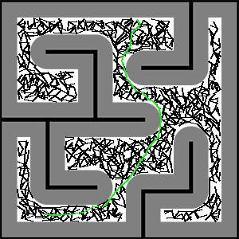

This is the final project of CSCI445 Introduction to Robotics in Spring 2020. In this project, we simulated a delivery robot (Roomba) holding up a cup to a robot arm. The delivery robot must first localize itself in the maze, and then plan a path to the robot arm. Then, motor commands are executed to drive the robot to the destination. Finally, a robot arm is responsible to pick up the cup and putting it onto a shelf. 

Several interesting topics are covered through this project. First, the Roomba needs to know its location at the maze. We use the particle filter method for this purpose. By randomly generating a large number of observation points inside the maze pretending they are the current location of Roomba (red arrows in the demo video) and then following Roomba to do random movements, the distribution of the sonar readings in all observation points or particles will gradually converge to that of the Roomba through resamplings. We can then approximate the Roomba's coordinate by averaging the coordinates of all observation points. 

After localization, a path needs to be planned for Roomba to reach the robot arm, where we use the Rapidly-exploring Random Tree (RRT) algorithm. Starting from the localized coordinate, a tree-like search path gradually expands outwards until reaches the maximum iteration. Then, a search path can be traversed from the point closest to the destination back to the starting point and return the path as a sequence of coordinates. For a smoother and shorter trajectory, we upgrade the algorithm to RRT* which rewires the tree when a shorter path is possible. The robot then follows the planned path using PID control and odometry until reaches the robot arm. After that, the robot arm with 6 degrees of freedom pick up the cup and place it onto the shelf through a series of hard-coded motor commands.

