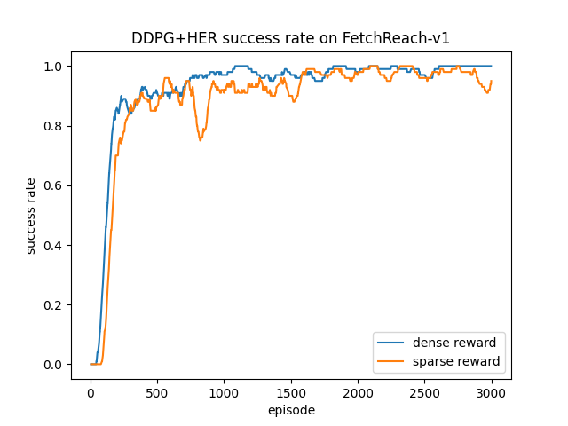

In this class project, I used the [Hindsight Experience Replay (HER)](https://arxiv.org/abs/1707.01495) algorithm to solve various tasks in the [OpenAI Gym Robotic](https://openai.com/blog/ingredients-for-robotics-research/) environment, specifically on the FetchReach and FetchSlide tasks. In FetchReach, the robot arm needs to move its end-effector to the desired goal position, while in FetchSlide, the robot arm needs to hit a puck across a long table such that it slides and comes to rest on the desired goal.

Tasks like FetchPush and FetchSlide faces the sparse reward problem: in traditional reinforcement learning algorithms, the robot arm agent need to perform random actions to explore the action space with the hope that it will reach the target by mere chance. However, since the arm can randomly move to any direction while the target location is way too small, the probability of hitting goals at the initial exploration phase is too small to learn anything. 

Nonetheless, with the experience replay technique, one may apply the HER sampling algorithms. Everytime the robot made a random move but failed to hit the target, we proposed an alternate goal: the robot did successfully hit the location that it randomly hit. Adding this “fake memory” and alternate goal into the experience buffer helps the reinforcement learning algorithm to converge significantly faster. 

